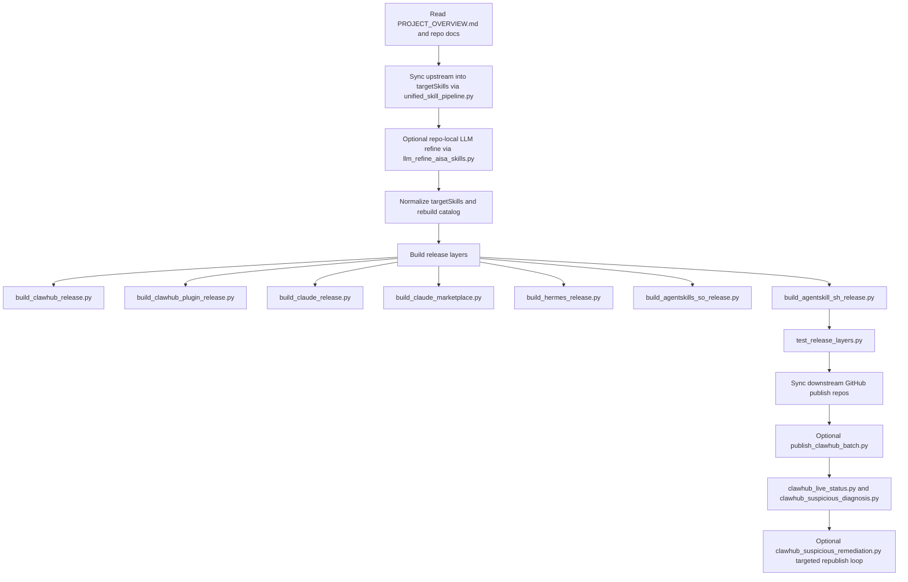

# agent-skills-io

Start here: [PROJECT_OVERVIEW.md](/mnt/d/workplace/agent-skills-io/PROJECT_OVERVIEW.md:1)

This repository is an AIsa skills migration, packaging, and publishing workbench. It is used to:

- analyze legacy OpenClaw / ClawPub skill bundles
- reshape them into cross-platform mother skills in `targetSkills/`
- generate platform release layers for ClawHub, Claude, Hermes, Agent Skills, and GitHub
- track suspicious / live-version drift and drive targeted republish work

## AI Working Rule

Any AI or collaborator working in this repo should:

1. Read `PROJECT_OVERVIEW.md` before substantial work.
2. Use it as the project map.
3. Update it after structural, workflow, or output changes.

More detailed repo rules live in [AGENTS.md](/mnt/d/workplace/agent-skills-io/AGENTS.md:1).

## Key Docs

- Core workflow:
  - [Task Execution Index](/mnt/d/workplace/agent-skills-io/targets/task-execution-index.md:1)
  - [Repo Runbook And Script Reference](/mnt/d/workplace/agent-skills-io/targets/repo-runbook-and-script-reference.md:1)
  - [Platform Skill And Plugin Methodology](/mnt/d/workplace/agent-skills-io/targets/platform-skill-plugin-methodology.md:1)
  - [Unified Pipeline And GitHub Actions](/mnt/d/workplace/agent-skills-io/targets/unified-pipeline-and-github-actions.md:1)
- Current audits:
  - [GitHub Actions And ClawHub Review 2026-05-08](/mnt/d/workplace/agent-skills-io/targets/github-actions-and-clawhub-review-2026-05-08.md:1)
  - [GitHub Actions Review 2026-05-07](/mnt/d/workplace/agent-skills-io/targets/github-actions-review-2026-05-07.md:1)
  - [GitHub Actions Review 2026-05-06](/mnt/d/workplace/agent-skills-io/targets/github-actions-review-2026-05-06.md:1)
  - [Platform Layer And Rule Split Audit 2026-04-28](/mnt/d/workplace/agent-skills-io/targets/platform-layer-and-rule-split-audit-2026-04-28.md:1)
  - [ClawHub Account Status 2026-04-28](/mnt/d/workplace/agent-skills-io/targets/clawhub-account-status-2026-04-28.md:1)
  - [Breakout Skill Plugin Registry 2026-04-28](/mnt/d/workplace/agent-skills-io/targets/breakout-skill-plugin-registry-2026-04-28.md:1)
  - [ClawHub Suspicious Causes And Fixes 2026-04-25](/mnt/d/workplace/agent-skills-io/targets/clawhub-suspicious-causes-and-fixes-2026-04-25.md:1)

## Rule Layers

The repo now separates neutral mother-skill rules, ClawHub breakout rules, and ClawHub suspicious-remediation rules.

- `scripts/llm_refine_aisa_skills.py`
  - Repo-local LLM refinement helper for AISA-backed skills under `targetSkills/`.
  - `--profile source` keeps output neutral and cross-platform.
  - `--profile clawhub_breakout` sharpens ClawHub-facing breakout copy only.
  - `--profile clawhub_suspicious` follows diagnosis-driven suspicious remediation only.
- `scripts/unified_skill_pipeline.py`
  - Main scheduler for upstream sync, mother-skill copy, release rebuild, validation, and optional publish chaining.
  - This is the normal entry point when you want one repeatable end-to-end run.
- `scripts/clawhub_suspicious_remediation.py`
  - Reads suspicious diagnosis, selects matching live artifacts, optionally requests a ClawHub rescan first, maps remaining blockers back to source skills, rebuilds ClawHub layers, and force-republishes only the targeted artifacts.
  - Targeted suspicious repair defaults to failing on slug conflicts so fallback slugs do not masquerade as fixes for the flagged URL.

The two repo-local editing skills define the rule boundary:

- `aisa-source-skill-editor`
  - For neutral `targetSkills/` editing only.
  - Prevents ClawHub-only breakout slugs, plugin wrapper fields, and platform-specific publish copy from leaking into the mother layer.
- `aisa-clawhub-breakout-editor`
  - For ClawHub breakout variants only.
- `aisa-clawhub-suspicious-remediation-editor`
  - For diagnosis-driven suspicious remediation only.
  - Keeps relay, OAuth, upload, static-analysis, and trust-surface fixes explicit without mixing in breakout growth copy.

## Pipeline Flow



## Scripts Used In The Flow

- `scripts/unified_skill_pipeline.py`
  - Orchestrates upstream diffing, `targetSkills/` sync, rebuild, test, and optional publish chaining.
- `scripts/sync_codex_repo_skills.py`
  - Refreshes repo-local `.agents/skills` from installed global `*-all` skills before repo-local LLM refinement.
- `scripts/llm_refine_aisa_skills.py`
  - Applies either neutral mother-skill rules or ClawHub breakout rules to changed AISA-backed skills.
- `scripts/normalize_target_skills.py`
  - Normalizes mother-skill frontmatter before release generation.
- `scripts/build_targetskills_catalog.py`
  - Rebuilds `targetSkills/index.md`, `index.json`, and `well-known-skills-index.json`.
- `scripts/build_clawhub_release.py`
  - Generates `clawhub-release/` from `targetSkills/`.
  - Also writes grouped docs so people can distinguish original slugs from breakout slugs without changing the flat publish layout.
- `scripts/build_clawhub_plugin_release.py`
  - Wraps `clawhub-release/` skills into native-first ClawHub/OpenClaw plugins.
- `scripts/build_claude_release.py`
  - Generates the Claude / GitHub / skills.sh conservative release layer.
- `scripts/build_claude_marketplace.py`
  - Builds the Claude plugin marketplace wrapper layer from `claude-release/`.
- `scripts/build_hermes_release.py`
  - Builds the Hermes category-organized release tree.
- `scripts/build_agentskills_so_release.py`
  - Builds the standards-first public layer for `agentskills.so`.
- `scripts/build_agentskill_sh_release.py`
  - Builds the GitHub-import layer for `agentskill.sh`.
- `scripts/test_release_layers.py`
  - Runs structure validation and representative smoke checks across generated release layers.
- `scripts/test_github_actions_workflow.py`
  - Locks self-hosted preflight, owner-type fallback, and hosted validation guard behavior.
- `scripts/test_clawhub_batch_publish_exit.py`
  - Prevents spare ClawHub token login timeouts from becoming false artifact publish failures.
- `scripts/test_clawhub_live_status_review.py`
  - Locks ClawHub ClawScan `Review` verdicts as suspicious blockers in live-status parsing and diagnosis.
- `scripts/test_clawhub_plugin_auth_metadata.py`
  - Locks native plugin auth/config metadata so AISA-backed plugins expose `AISA_API_KEY` before runtime loads.
- `scripts/test_twitter_oauth_client_safety.py`
  - Locks Twitter public-write safety boundaries for reply, quote, threading, and API-key redaction.
- `scripts/publish-targetSkills-to-agent-skills.sh`
  - Compatibility alias for the agentskill.sh publish lane. Rebuilds/syncs `agentskill-sh-release/` into `baofeng-tech/agent-skills` (default local checkout: `../agent-skills-own`).
- `scripts/publish-claude-release.sh`
  - Syncs Claude standalone and optional Claude marketplace repos.
- `scripts/publish-hermes-release.sh`
  - Syncs `hermes-release/` into the Hermes GitHub publish repo.
- `scripts/publish-agentskills-so-release.sh`
  - Syncs `agentskills-so-release/` into its public GitHub repo.
- `scripts/publish-agentskill-sh-release.sh`
  - Syncs `agentskill-sh-release/` into its GitHub import repo.
- `scripts/publish_clawhub_batch.py`
  - Multi-token ClawHub batch publisher with artifact filters, state continuation, optional post-publish scan, and slot-sticky fallback slug routing for owner conflicts.
- `scripts/clawhub_live_status.py`
  - Pulls live ClawHub scan state back into local JSON, validates fallback slugs against current detail URLs, and reads ClawHub security subpages when the main page is not enough.
- `scripts/clawhub_suspicious_diagnosis.py`
  - Classifies suspicious / pending artifacts into rule buckets.
- `scripts/clawhub_rescan_artifacts.py`
  - Requests ClawHub skill/package rescans for selected artifact keys and can inspect after a wait window.
- `scripts/clawhub_suspicious_remediation.py`
  - Runs the targeted rescan-first repair loop for selected suspicious or pending artifacts.
- `scripts/clawhub_breakout_rollout.py`
  - Runs the dedicated breakout lane from `targets/clawhub-breakout-variants.json`, then optionally rebuilds, syncs, and publishes the selected breakout skills/plugins.

## ClawHub Slug Layout

`clawhub-release/` stays flat because publish, test, and live-status scripts currently scan `clawhub-release/*` directly.

To make it easier for humans to read:

- `clawhub-release/README.md` now groups original slugs and breakout slugs separately.
- `clawhub-release/index.md` now mirrors that grouping.
- `clawhub-release/slug-groups.json` is the machine-readable split.
- `targets/clawhub-breakout-variants.json` remains the single source of truth for breakout declarations.

## Recommended Commands

Preview the next upstream sync:

```bash
python3 scripts/unified_skill_pipeline.py --dry-run
```

Sync upstream updates into `targetSkills/`, rebuild every release layer, and run validation:

```bash
python3 scripts/unified_skill_pipeline.py
```

Run a release-only rebuild from the current mother skills:

```bash
python3 scripts/normalize_target_skills.py
python3 scripts/build_targetskills_catalog.py
python3 scripts/build_clawhub_release.py
python3 scripts/build_clawhub_plugin_release.py
python3 scripts/build_claude_release.py
python3 scripts/build_claude_marketplace.py
python3 scripts/build_hermes_release.py
python3 scripts/build_agentskills_so_release.py
python3 scripts/build_agentskill_sh_release.py
python3 scripts/test_release_layers.py
```

Check live ClawHub VirusTotal / ClawScan / Static analysis verdicts from the saved publish state:

```bash
python3 scripts/clawhub_live_status.py --targets both
```

Run targeted ClawHub suspicious remediation for selected artifacts:

```bash
python3 scripts/clawhub_suspicious_remediation.py \
  --apply \
  --rescan-before-repair \
  --sync-repo-skills \
  --llm-if-available \
  --clawhub-publish both \
  --post-publish-scan \
  --artifacts plugin:aisa-twitter-post-engage-plugin,plugin:market-plugin
```

## GitHub Actions And Auto Publish

`.github/workflows/unified-skill-pipeline.yml` now has one hosted lane plus three independent self-hosted lanes:

- hosted lane
  - schedule or manual dispatch
  - sync, rebuild, validate, upload artifacts, refresh suspicious diagnosis, and commit repo outputs back here
- self-hosted publish lane
  - optional true publish continuation for the normal upstream-sync flow
  - syncs selected downstream GitHub publish repos
  - can batch-publish ClawHub skills/plugins
- self-hosted suspicious-remediation lane
  - reads diagnosis output and can now auto-select self-owned blocker artifacts when no explicit artifact list is supplied
  - can rebuild, republish, and re-scan only that suspicious subset
- self-hosted breakout lane
  - runs the dedicated breakout rollout path from `targets/clawhub-breakout-variants.json`
  - keeps breakout experimentation separate from normal sync and suspicious remediation

Schedule and manual runs now use `auto` continuation planning by default. The hosted lane reads the actual pipeline result, diagnosis output, and breakout live status before requesting downstream publish, suspicious remediation, or breakout rollout.

Use `AUTO_FULL_PLATFORM_PUBLISH`, `AUTO_RUN_SUSPICIOUS_REPAIR`, or `AUTO_RUN_BREAKOUT_ROLLOUT` as `auto`, `true`, or `false`. Requested continuation lanes still prefer an online self-hosted runner, but can fall back to GitHub-hosted runners when `AUTO_ALLOW_HOSTED_CONTINUATION` is true.

Useful repo variables for scheduled self-hosted automation:

- `AUTO_PIPELINE_DRY_RUN`
- `AUTO_PIPELINE_SELECTION`
- `AUTO_DIAGNOSIS_DOC_UPDATE`
- `AUTO_RUN_AISA_API_REGRESSION`
- `AUTO_RUN_LLM_STEP`
- `AUTO_LLM_APPLY`
- `AUTO_SYNC_REPO_SKILLS`
- `AUTO_SYNC_ADJACENT_REPOS`
- `AUTO_ADJACENT_TARGETS`
- `AUTO_PUSH_ADJACENT_REPOS`
- `AUTO_CLAWHUB_PUBLISH`
- `AUTO_CLAWHUB_DRY_RUN`
- `AUTO_CLAWHUB_POST_PUBLISH_SCAN`
- `AUTO_RUN_SUSPICIOUS_REPAIR`
- `AUTO_SUSPICIOUS_ARTIFACTS`
- `AUTO_SUSPICIOUS_MAX_ARTIFACTS`
- `AUTO_RUN_BREAKOUT_ROLLOUT`
- `AUTO_BREAKOUT_SKILLS`
- `AUTO_BREAKOUT_PUBLISH`
- `AUTO_INSTALL_CLAWHUB_CLI`
- `AUTO_FORCE_SELF_HOSTED_QUEUE`
- `AUTO_HERMES_PUBLISH_MODE`
- `SELF_HOSTED_RUNNER_RUNS_ON_JSON`
- `CLAWHUB_CLI_VERSION`

Use `SELF_HOSTED_RUNNER_RUNS_ON_JSON` as the single source for runner labels, for example `["self-hosted","linux","clawhub"]`. The preflight and the actual `runs-on` target both read this JSON value. This variable only selects labels; it does not register, start, or bring a GitHub runner online.

For `SELF_HOSTED_RUNNER_API_TOKEN`, repository-level runners need fine-grained PAT repository `Administration: read`. Organization-level runners need organization `Self-hosted runners: read`; otherwise the repo runner API may return `403`. If the repo runner API returns `200` with `total_count=0`, the token is readable but no repository runner is registered or online.

The CI bootstrap installs `openai`, `httpx`, and `requests` because some AISA-backed runtime checks use the OpenAI-compatible Python SDK or HTTP clients against `api.aisa.one`; this does not require an OpenAI API key.

What GitHub Actions can do in practice:

- ClawHub
  - Yes, the self-hosted lane can now optionally install or refresh the CLI with `npm install -g clawhub@<version>` before publish.
  - Current ClawHub pages also expose CLI usage in the form `npx clawhub@latest install ...` and local publish commands such as `clawhub package publish ...`.
- Hermes
  - Yes. The default mode still syncs `hermes-release/` into the Hermes GitHub publish repo.
  - The self-hosted lane now also supports `hermes_publish_mode=cli` when the runner already has `hermes` installed.
  - If you want the CLI on a runner anyway, Hermes' official install docs currently describe the `uv`-based install path from `NousResearch/hermes-agent`.

## Operational Notes

- `targetSkills/` is the mother-skill source of truth.
- For larger upstream deltas, `AIsa-team/agent-skills@main` is the authority to follow before reshaping into mother skills and downstream releases here.
- `AIsa-team/agent-skills` is a read-only upstream for this repo. Automation must never push back to it.
- Generated release layers should be rebuilt from `targetSkills/`, not hand-edited as primary sources.
- Local credentials can be looked up from `example/accounts`, but CI should prefer secrets.
- `AIsa-team/agent-skills` is currently public, so `UPSTREAM_REPO_TOKEN` is optional fallback rather than a default requirement.
- Do not use `/mnt/d/workplace/agent-skills` as this repo's automation source; that checkout is reserved for manual company-skill authoring and upload work.
- If WSL-side ClawHub network access is flaky, this workspace can publish or scan through `cmd.exe /c ... py -3 scripts\\publish_clawhub_batch.py` and `scripts\\clawhub_live_status.py` on the Windows side without changing repo structure.
